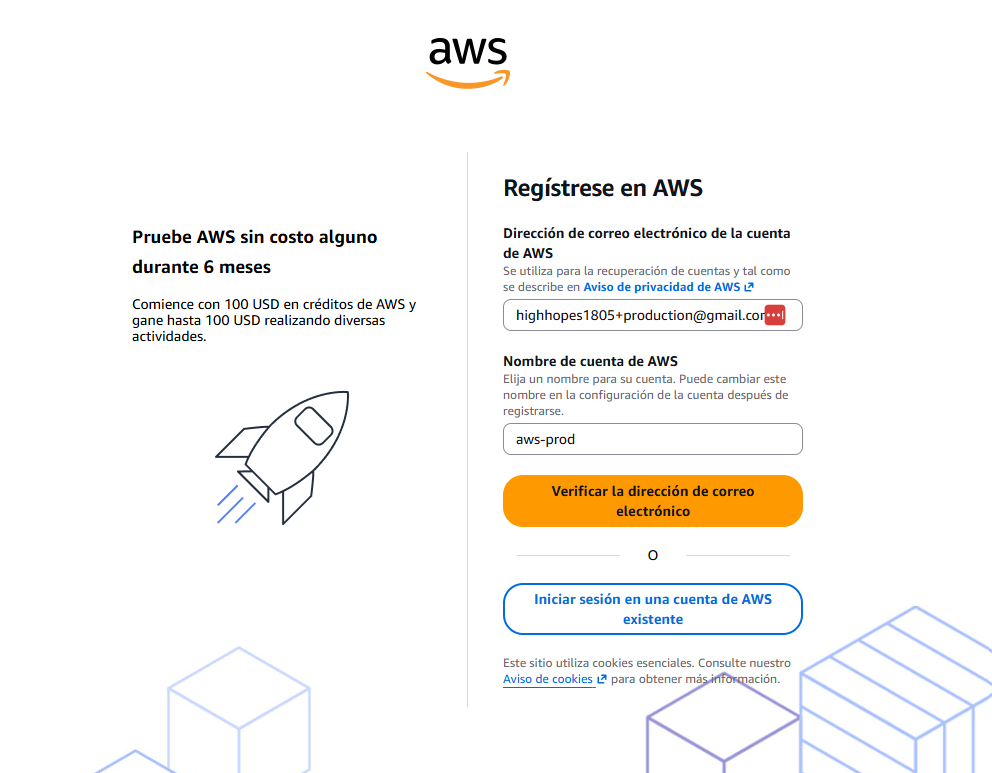
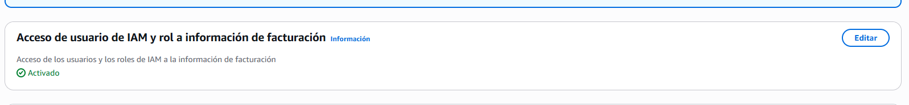

# Creación de una organización en AWS

Proyecto del módulo 4 del Bootcamp de DevOps y Cloud.

En este proyecto se documenta paso a paso la creación y configuración de una organización en AWS (AWS Organizations): protección de la cuenta raíz, creación del usuario administrador, cuentas miembro, unidades organizativas (OUs) y políticas de servicio (SCPs).

## Índice

1. [Protección de la cuenta root](#1-protección-de-la-cuenta-root)
2. [Creación del usuario administrador (aws-admin)](#2-creación-del-usuario-administrador-aws-admin)
3. [Creación de la cuenta aws-production](#3-creación-de-la-cuenta-aws-production)
4. [Activación del acceso de IAM a la facturación](#4-activación-del-acceso-de-iam-a-la-facturación)

---

## 1. Protección de la cuenta root

Al crear la cuenta de AWS se genera el usuario **root**, que tiene control total y absoluto sobre la cuenta. Por seguridad, este usuario **debe protegerse al máximo** y no utilizarse para el trabajo diario:

- Se usa únicamente para tareas que lo requieran estrictamente (facturación, cierre de cuenta, etc.).
- Se recomienda activar la **autenticación multifactor (MFA)** y utilizar una contraseña robusta.
- Nunca se deben generar claves de acceso (access keys) para el usuario root.

## 2. Creación del usuario administrador (aws-admin)

Desde la cuenta root se crea el usuario **`aws-admin`** con **permisos de administrador** (política `AdministratorAccess`).

A partir de este momento, **toda la operativa diaria se realiza con `aws-admin`**, dejando el usuario root guardado y protegido.

## 3. Creación de la cuenta aws-production

Se crea la cuenta **`aws-production`**, que será una de las cuentas miembro de la organización.

Cada cuenta de AWS necesita una dirección de correo única. Para no tener que crear un buzón de correo nuevo por cada cuenta, se utiliza el **truco de los alias de Gmail**, añadiendo `+nombre` al correo principal:

```
correo+nombre@gmail.com
```

Por ejemplo: `micorreo+production@gmail.com`. Gmail entrega todos los mensajes al mismo buzón (`micorreo@gmail.com`), pero AWS lo considera una dirección diferente, lo que permite registrar varias cuentas con un único correo real.

En el formulario de registro se introduce el correo con el alias `+production` y como nombre de cuenta **`aws-prod`**:



## 4. Activación del acceso de IAM a la facturación

Por defecto, los usuarios y roles de IAM **no pueden ver la información de facturación** de la cuenta, aunque tengan permisos de administrador: es una opción que solo puede activar el usuario root.

Para que el usuario `aws-admin` pueda consultar la facturación sin necesidad de usar root, se inicia sesión con la cuenta **root** y se activa la opción **"Acceso de usuario de IAM y rol a información de facturación"** (*IAM user and role access to Billing information*), disponible en la configuración de la cuenta (**Account → Configuración de la cuenta**).

Una vez activada, la opción aparece con el estado **Activado**:


